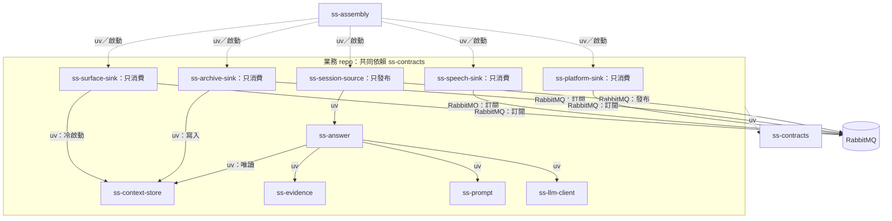
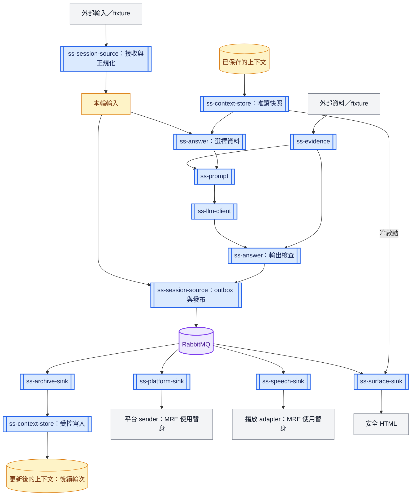

# Proposed MRE architecture

依賴圖的箭頭是「相依方 → 被依賴方」。虛線表示共同型別或組合啟動；RabbitMQ 線是通訊相依。
CLI argument parsing is local invocation, not a legacy routing module.

資料圖的箭頭是「資料來源 → 接收者」。藍色雙框是 repo，黃色是資料，灰色是外部來源／輸出，紫色是 Broker。
同一 repo 可分成多個執行階段；兩個 DB 節點是相同資料在不同時間的狀態。

## Ownership

- Context schema/migrations/read/write API: ss-context-store. Event-driven context writes: ss-archive-sink only.
- Input cache and event outbox: ss-session-source/source.db, separate from context.
- Delivery checkpoints: ss-platform-sink/delivery.db; playback: ss-speech-sink/speech.db; projection: ss-surface-sink/surface.db.
- Store reader returns an explicit as-of snapshot. Current input is passed directly to answer, without waiting for archive feedback.
- Assembly configures infrastructure and installs pinned packages; it owns no business data.

## First MRE scope

This release proves the boundaries with deterministic fixtures and opt-in AMQP adapters.
Long-term governed facts, entity knowledge, multi-turn clarification, loyalty/games, scheduling, WebSocket Lens ingest, actual platform/TTS/Spout adapters and production operating controls need separate capability MREs or later extensions. No feature parity claim is made.
